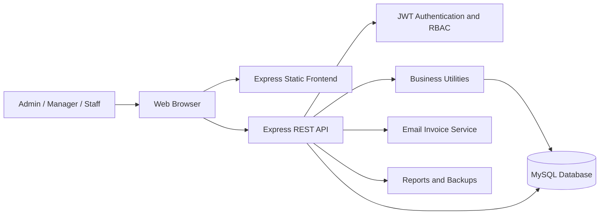
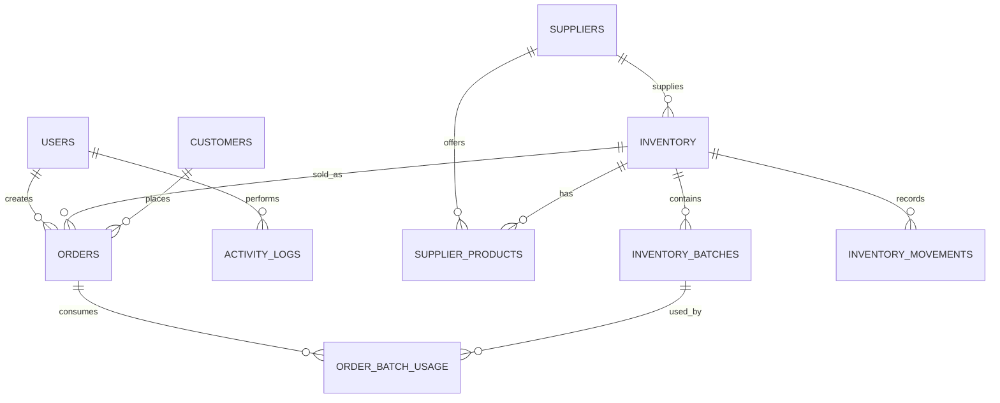
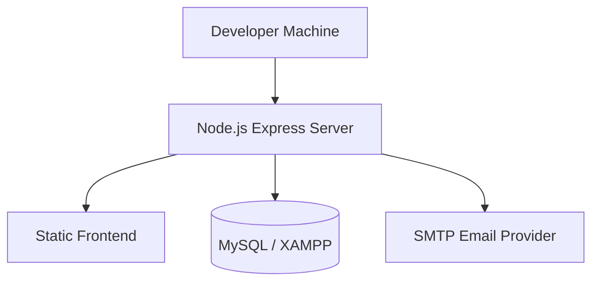

# Smart Inventory Management System - Architecture Document

## 1. Project Overview

Smart Inventory Management System is a full-stack inventory and sales management application for retail or warehouse operations. The system supports product stock tracking, FIFO batch-based inventory deduction, supplier management, order processing, customer history, staff access control, analytics dashboards, exports, monitoring, and invoice delivery.

The application is built with a Node.js and Express.js backend, a MySQL database, and a vanilla HTML, CSS, and JavaScript frontend served from the same Express application.

## 2. Architecture Style

The project follows a layered web application architecture:

- Presentation Layer: Browser-based UI in `public/`
- API Layer: Express route modules in `routes/`
- Business Logic Layer: Inventory, alerts, logging, mail, validation, and movement utilities in `lib/` and `src/shared/`
- Data Access Layer: MySQL connection pool and SQL queries using `mysql2`
- Database Layer: MySQL schema, migrations, and bootstrapping scripts in `db/`

This structure keeps the user interface, HTTP endpoints, reusable business logic, and database concerns separated while still remaining simple enough for a small to medium inventory system.

## 3. Technology Stack

| Layer | Technology |
| --- | --- |
| Frontend | HTML5, CSS3, Vanilla JavaScript, Chart.js |
| Backend | Node.js, Express.js |
| Database | MySQL 8+ |
| Authentication | JWT, bcryptjs |
| Email | nodemailer |
| Exports | CSV/PDF-style generated reports |
| Development | nodemon |

## 4. High-Level System Flow

## 5. Main Application Components

### 5.1 Frontend

The frontend is located in `public/` and is served directly by Express.

Key files:

- `public/index.html`: Main single-page interface
- `public/app.js`: Authentication, navigation, orders, customers, employees, invoices, exports, and shared UI behavior
- `public/inventory.js`: Inventory CRUD, restocking, supplier linking, batch management, and stock workflows
- `public/suppliers.js`: Supplier listing and supplier product intelligence
- `public/dashboard.js`: Sales reports, charts, alerts, approvals, and dashboard metrics
- `public/styles.css` and `public/theme.css`: UI styling and theme rules

The frontend communicates with the backend through `/api/*` endpoints and stores the JWT token client-side for authenticated requests.

### 5.2 Backend Application

The backend starts through `server.js`, which loads `src/server.js`. The Express app is created in `src/app.js`.

Backend responsibilities:

- Serve static frontend assets
- Parse JSON and form data
- Enable CORS
- Register API routes
- Provide `/api/health`
- Return `index.html` for non-API routes
- Handle 404 and centralized errors

### 5.3 API Route Modules

| Module | Base Path | Responsibility |
| --- | --- | --- |
| `routes/auth.js` | `/api/auth` | Login, current user, logout, password reset/change |
| `routes/inventory.js` | `/api/inventory` | Product CRUD, stock alerts, pending approvals, supplier links, restock, FIFO batches |
| `routes/suppliers.js` | `/api/suppliers` | Supplier CRUD, supplier intelligence, supplier products |
| `routes/orders.js` | `/api/orders` | Order CRUD, FIFO stock deduction/restoration, breakdowns, invoice email |
| `routes/employees.js` | `/api/employees` | User/staff management |
| `routes/customers.js` | `/api/customers` | Customer CRUD and customer order history |
| `routes/exports.js` | `/api/exports` | Daily exports and report downloads |
| `routes/monitoring.js` | `/api/monitoring` | Audit logs, system overview, team health, backups |

## 6. Authentication and Authorization

The system uses JWT-based authentication.

Authentication flow:

1. User submits login credentials.
2. Backend validates the user and password using bcrypt.
3. Backend returns a signed JWT.
4. Frontend sends the token in the `Authorization: Bearer <token>` header.
5. `middleware/auth.js` verifies the token and attaches the decoded user to `req.user`.
6. Role guards restrict protected routes.

Supported roles:

| Role | Access Level |
| --- | --- |
| Admin | Full control, user management, approvals, deletes, audits, backups |
| Manager | Inventory and supplier operations, restocking, order management, monitoring |
| Staff | Daily operations such as viewing inventory and creating orders |

## 7. Database Architecture

The project uses MySQL with a connection pool defined in `db/connection.js`. The main schema is in `db/schema.sql`, while runtime compatibility and additional tables are handled by `db/bootstrap.js`.

Core tables:

- `users`: Login accounts, roles, departments, and employee details
- `suppliers`: Supplier profile and performance details
- `inventory`: Product master data and current stock summary
- `orders`: Customer orders and order status
- `inventory_movements`: Stock movement audit trail
- `supplier_products`: Supplier-to-product mapping, pricing, quality, and lead-time data
- `activity_logs`: User and system activity audit records
- `customers`: Customer contact and history support
- `inventory_batches`: FIFO stock batches with purchase cost, selling price, and available quantity
- `order_batch_usage`: Tracks which inventory batches were consumed by each order

## 8. Entity Relationship View

## 9. Key Business Workflows

### 9.1 Inventory Restocking

1. Admin or manager selects a product.
2. User enters supplier, quantity, purchase cost, selling price, and optional expiry date.
3. Backend creates or updates the related inventory batch.
4. Product stock is recalculated from active batches.
5. Inventory status is recalculated using low-stock rules.
6. Stock movement and activity logs are recorded.

### 9.2 FIFO Order Processing

1. User creates an order for a selected inventory item.
2. Backend checks available stock.
3. Stock is deducted from the oldest available batches first.
4. Batch usage is saved in `order_batch_usage`.
5. Order total cost and profit can be calculated from consumed batch costs.
6. Inventory stock and status are synchronized.
7. Low-stock alerts may be triggered.

### 9.3 Order Cancellation and Restoration

1. Order status changes to cancelled or the order is deleted.
2. Backend reads the original batch usage.
3. Stock is restored to the same batches that were consumed.
4. Inventory summary stock is synchronized.
5. Inventory movement and activity logs are updated.

### 9.4 Dashboard and Monitoring

1. Frontend requests analytics from dashboard and monitoring APIs.
2. Backend aggregates order, inventory, supplier, audit, and staff data from MySQL.
3. Frontend renders summary cards, alerts, charts, pending approvals, and reports.

### 9.5 Invoice Email

1. User requests invoice email for an order.
2. Backend validates order details and customer contact information.
3. `lib/mailer.js` sends the invoice through nodemailer.
4. Activity is logged for tracking.

## 10. Security Design

Security controls include:

- JWT authentication for protected APIs
- Role-based authorization for admin, manager, and staff workflows
- bcrypt password hashing
- Centralized validation helpers
- Restricted destructive actions such as deletes and backups
- Activity logs for important actions
- Status-based invoice generation and order workflows

Recommended future hardening:

- Move JWT storage to httpOnly cookies for stronger browser protection
- Add rate limiting on login and password reset endpoints
- Add request validation coverage to all write routes
- Add database transaction wrappers around every multi-step inventory/order workflow
- Hide `.env` values and rotate secrets before deployment

## 11. Deployment Architecture

Typical local deployment:

Required environment variables:

- `PORT`
- `DB_HOST`
- `DB_PORT`
- `DB_USER`
- `DB_PASSWORD`
- `DB_NAME`
- `JWT_SECRET`
- `JWT_EXPIRES_IN`
- SMTP variables for email delivery, if invoice email is enabled

## 12. Quality Attributes

| Attribute | Project Support |
| --- | --- |
| Maintainability | Separate route modules, shared utilities, and frontend modules |
| Security | JWT, RBAC, bcrypt, protected admin routes |
| Reliability | Auto-bootstrapping database fixes and stock synchronization |
| Auditability | Activity logs and inventory movement records |
| Usability | Single-page dashboard with inventory, orders, suppliers, customers, and reports |
| Extensibility | Route-per-domain structure allows new modules to be added cleanly |

## 13. Future Enhancements

- Add automated tests for FIFO order creation, cancellation, and restoration
- Use database transactions for order and restock workflows
- Add normalized order item support for multi-product orders
- Add pagination and filtering for large datasets
- Add formal migration tooling instead of mixed schema plus bootstrapping
- Add role-specific dashboard views
- Add REST API documentation with request and response examples
- Add production deployment guide for cloud hosting

